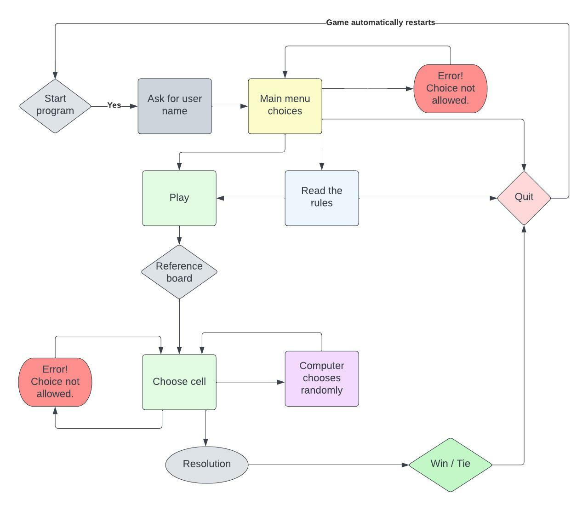
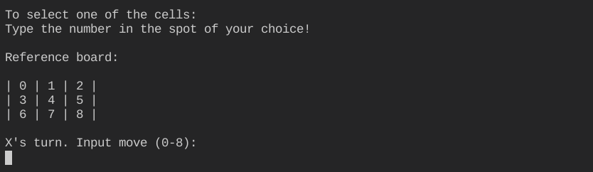
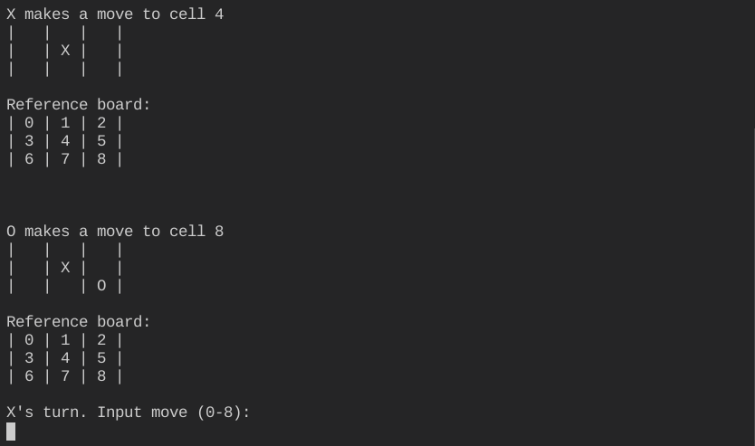

# Tic Tac Toe game

[Deployed Game Link]

&nbsp;

## Table of Contents
---

- [UX](#ux)
    - [Website owners goals](#website-owners-goals)
    - [Users goals](#users-goals)
    - [Flow Chart](#flow-chart)
- [Features](#features)
    - [Game](#game)
    - [Future feature to implement](#future-feature-to-implement)
- [Technologies used](#tecnologies-used)
- [Libraries used](#libraries-used)
- [Testing and Validation](#testing-and-validation)
    - [PEP8](#pep8)
    - [Manual testing](#manual-testing)
    - [User stories testing](#user-stories-testing)
    - [Bugs](#bugs)
        - [From the Slack feedback request](#from-the-slack-feedback-request)
    - [Unfixed Bugs](#unfixed-bugs)
- [Deployment](#deployment)
    - [How to deploy](#how-to-deploy)
- [Credits](#credits)

&nbsp;

## UX
---

### Website owners goals
The goal of this program is to play a game of Tic Tac Toe against the computer.
Tic-tac-toe is a game in which two players take turns in drawing either an 'O' or an 'X' in one square of a grid consisting of nine squares. The winner is the first player to get three of the same symbols in a row, vertically, horizontally or diagonally.

&nbsp;

### User goals
For the program owner:
- Offer entertainment to their user willing to play the game.
- Give informations about the game.
- Give options to the user to quit the game through the menu navigation.

For new users and returning visitors:
- Excercise their Tic Tac Toe skills playing against the computer.
- Easy to navigate commands and interface.
- Reference navigation commands always available.

&nbsp;

### Flow Chart
To create the structure of the game, this diagram was created using [Lucid Charts](https://www.lucidchart.com/)

&nbsp;

[Back to Table of contents](#table-of-contents)

&nbsp;

## Features
---

### Game
Here's what the program does and how the game plays:

1. Welcome Screen which asks for the name of the user.

2. Once the user has input their name, the main menu of the game asks the user what they would like to do next giving them a choice to play immediately, check the rules of the game, or quitting the game.

3. If the user selects to review the rules of the game, a description appears and then the user gets asked to select another options from playing or quitting the game.

4. If the user chooses to quit the game, a thank you message appears on the screen and the program quits.

5. If the user chooses to play, the firts turn instruction and reference board will populate the screen. Then the user will get propted for a first choice.

6. After the user inputs their choice, the choice gets shown into the board and the cumputer makes its move which gets shown on the board as well. Then the program asks for the next move from the user.

7. The promt for a choice will continue until the game is won with three symbols in a row or both players have run out of moves.

&nbsp;

### Future feature to implement
- Online multiplayer: the ability to play online with friends.
- Two players mode on the same device.
- Improve the computer difficulties in three different levels: easy, intermediate and hard.

&nbsp;

[Back to Table of contents](#table-of-contents)

&nbsp;

## Technologies Used
---

- JavaScript - generated from the python essential template build by Code Institute.
- GitHub - Version control.
- GitPod - IDE used to code the program and for some of the manual testing.
- Heroku - Program deployment for the users to access it without deploy it themselves.

&nbsp;

[Back to Table of contents](#table-of-contents)

&nbsp;

## Libraries used
---

- Math - for calculation and managment of numbers and data types.
- Random - to randomize the choices of the computer player.
- Time - to slow down the respode of the program and allow the user to view the response of the computer.

&nbsp;

[Back to Table of contents](#table-of-contents)

&nbsp;

## Testing and Validation
---

### PEP8
The code was checked with PEP8 validator and passed with no error found.

&nbsp;

### Manual testing
All features have been tested manually with a Mac Mini and a Chromebook with multiple browsers (Chrome, Safari, Firefox).

&nbsp;

### User stories testing
For the program owner:
- The game offers entertainment to the users and the chance to play it multiple times.
- The game contains informations about the game of Tic Tac Toe that the user can easily access.
- The game give options to the user to quit the game at the menu if they would like.

For new users and returning visitors:
- The user can improve their skill at the game excercising with this program which puts them against the computer.
- The user can navigate through the game with very easy commands
- Always available reference of the possible choices when making a move, makes it easy to find the right commands.

&nbsp;

### Bugs
- Game automatically lets user win at first move. Fixed missing colon and indentation in "winner" function.
- Corrected prompt to the user for the next move to suggest numbers from 0-8, since is 0 index based instead of 1-9.
- Added extra spaces in-between command line prompt to help visual clarity for the user.

&nbsp;

#### From the Slack feedback request

&nbsp;

### Unfixed Bugs
- None that I'm aware of at the moment.

&nbsp;

## Deployment
There is only this main branch of the project version available in GitHub.
This version is also deployed live on Heroku - [Link]

### How to deploy
To deploy this page to Heroku from its [GitHub repository](https://github.com/alessandracosta8/Tic-Tac-Toe) the following steps were taken:

- Log into or register a new account at [Heroku](https://www.heroku.com/).
- Click on the button **New** in the top right corner of the dashboard.
- From the drop-down menu then select **Create new app**.
- Enter your app name in the first field, the names must be unique so check that then name you have chosen is available on Heroku, then select your region.
- Click on **Create App**.
- Once the app is created you will see the Overview panel of the application. Now move to the **Settings** tab.
- Once you are in the **Settings** tab scroll down till you find **Config Vars**.
- Press the button **Reveal Config Vars** and for 'KEY' field, type in 'PORT' and for the value field type in '8000'.
Then press the **Add** button.
- Scroll down to **Buildpacks**. Click the button **Add buildpack** and select 'python'. Do the same step and add 'node.js'.
**PYTHON MUST BE ON TOP OF THE BUILDPACKS. IF IN YOUR CASE NODE.JS IS FIRST, CLICK AND DRAG PYTHON TO TOP AND SAVE.**
- Return back to the **Deploy** tab. From the deployment method, select 'Github' as the deployment.
- You will be asked to connect your github account. Confirm and proceed.
- Search for your repository name and connect.
- Once that is done and successfully connected, select how you want to push updates from the following options.

  _Clicking **Enable Automatic Deploys**. This will update once you push updates to your Github._

  _Selecting the correct branch for deployment from drop-down menu and pressing **Deploy Branch** button. This will have to be done everytime manually._

&nbsp;

[Back to Table of contents](#table-of-contents)

&nbsp;

## Credits
---

- [Python Classmethods and Staticmethods](https://www.youtube.com/watch?v=rq8cL2XMM5M)
- [12 Beginner Python Projects](https://www.youtube.com/watch?v=8ext9G7xspg&t=2189s)
- [Tic Tac Toe definition - Collins Dictionary](https://www.collinsdictionary.com/dictionary/english/tic-tac-toe#:~:text=Tic%2Dtac%2Dtoe%20is%20a,same%20symbols%20in%20a%20row.)
- [W3 Schools](https://www.w3schools.com/)
- [Github](https://github.com/marcin-kli/MP1/blob/Milestone-Projects/README.md) - README file example
- Mentor: Adegbenga Adeye - For his support and patience!

&nbsp;

[Back to Table of contents](#table-of-contents)
