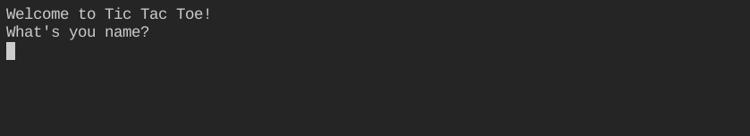
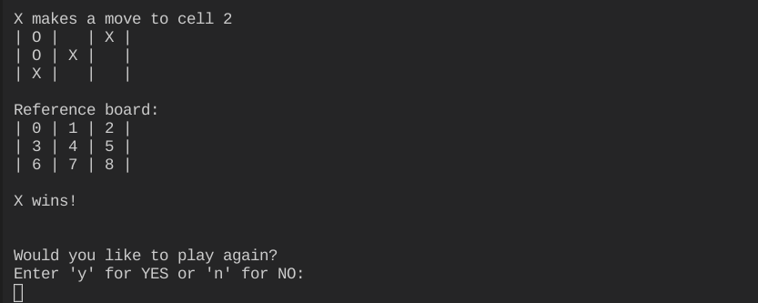

# Tic Tac Toe game

[Deployed Game Link]

&nbsp;

## Table of Contents
---

- [UX](#ux)
    - [Website owners goals](#website-owners-goals)
    - [Users goals](#users-goals)
    - [Flow Chart](#flow-chart)
- [Features](#features)
    - [Game](#game)
    - [Future feature to implement](#future-feature-to-implement)
- [Technologies used](#tecnologies-used)
- [Libraries used](#libraries-used)
- [Testing and Validation](#testing-and-validation)
    - [PEP8](#pep8)
    - [Manual testing](#manual-testing)
    - [User stories testing](#user-stories-testing)
    - [Bugs](#bugs)
        - [From the Slack feedback request](#from-the-slack-feedback-request)
    - [Unfixed Bugs](#unfixed-bugs)
- [Deployment](#deployment)
- [Credits](#credits)

&nbsp;

## UX
---

### Website owners goals
The goal of this program is to play a game of Tic Tac Toe against the computer.
Tic-tac-toe is a game in which two players take turns in drawing either an 'O' or an 'X' in one square of a grid consisting of nine squares. The winner is the first player to get three of the same symbols in a row, vertically, horizontally or diagonally.

&nbsp;

### User goals
For the program owner:
- Offer entertainment to their user willing to play the game.
- Give informations about the game.
- Give options to the user to quit the game through the menu navigation.

For new users and returning visitors:
- Excercise their Tic Tac Toe skills playing against the computer.
- Easy to navigate commands and interface.
- Reference navigation commands always available.

&nbsp;

### Flow Chart
To create the structure of the game, this diagram was created using [Lucid Charts](https://www.lucidchart.com/)

&nbsp;

## Features
---

### Game
1. Welcome Screen which asks for the name of the user.

2. Once the user has input their name, the main menu of the game asks the user what they would like to do next giving them a choice to play immediately, check the rules of the game, or quitting the game.

3. If the user selects to review the rules of the game, a description appears and then the user gets asked to select another options from playing or quitting the game.

4. If the user chooses to quit the game, a thank you message appears on the screen and the program quits.

5. If the user chooses to play, the firts turn instruction and reference board will populate the screen. Then the user will get propted for a first choice.

6. After the user inputs their choice, the choice gets shown into the board and the cumputer makes its move which gets shown on the board as well. Then the program asks for the next move from the user.

7. The promt for a choice will continue until the game is won with three symbols in a row or both players have run out of moves.

&nbsp;

### Future feature to implement
- Online multiplayer: the ability to play online with friends.
- Two players mode on the same device.
- Improve the computer difficulties in three different levels: easy, intermediate and hard.

&nbsp;

## Technologies Used
---

- JavaScript - generated from the python essential template build by Code Institute.
- GitHub - Version control.
- GitPod - IDE used to code the program and for some of the manual testing.
- Heroku - Program deployment for the users to access it without deploy it themselves.

&nbsp;

## Libraries used
---

- Math - for calculation and managment of numbers and data types.
- Random - to randomize the choices of the computer player.
- Time - to slow down the respode of the program and allow the user to view the response of the computer.

&nbsp;

## Testing and Validation
---

### PEP8
The code was checked with PEP8 validator and passed with no error found.

&nbsp;

### Manual testing
All features have been tested manually with a Mac Mini and a Chromebook with multiple browsers (Chrome, Safari, Firefox).

&nbsp;

### User stories testing
For the program owner:
- The game offers entertainment to the users and the chance to play it multiple times.
- The game contains informations about the game of Tic Tac Toe that the user can easily access.
- The game give options to the user to quit the game at the menu if they would like.

For new users and returning visitors:
- The user can improve their skill at the game excercising with this program which puts them against the computer.
- The user can navigate through the game with very easy commands
- Always available reference of the possible choices when making a move, makes it easy to find the right commands.

## Index

* Your code must be placed in the `run.py` file
* Your dependencies must be placed in the `requirements.txt` file
* Do not edit any of the other files or your code may not deploy properly

## Creating the Heroku app

When you create the app, you will need to add two buildpacks from the _Settings_ tab. The ordering is as follows:

1. `heroku/python`
2. `heroku/nodejs`

You must then create a _Config Var_ called `PORT`. Set this to `8000`

If you have credentials, such as in the Love Sandwiches project, you must create another _Config Var_ called `CREDS` and paste the JSON into the value field.

Connect your GitHub repository and deploy as normal.

## Constraints

The deployment terminal is set to 80 columns by 24 rows. That means that each line of text needs to be 80 characters or less otherwise it will be wrapped onto a second line.

-----
Happy coding!

&nbsp;

## Credits
---

[Python Classmethods and Staticmethods](https://www.youtube.com/watch?v=rq8cL2XMM5M)

[12 Beginner Python Projects](https://www.youtube.com/watch?v=8ext9G7xspg&t=2189s)

[Tic Tac Toe definition - Collins Dictionary](https://www.collinsdictionary.com/dictionary/english/tic-tac-toe#:~:text=Tic%2Dtac%2Dtoe%20is%20a,same%20symbols%20in%20a%20row.)

&nbsp;

[Back to Table of contents](#table-of-contents)
